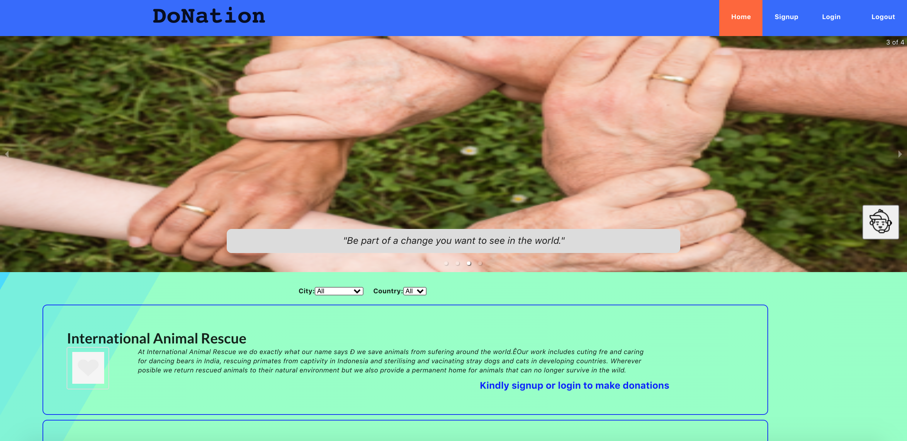
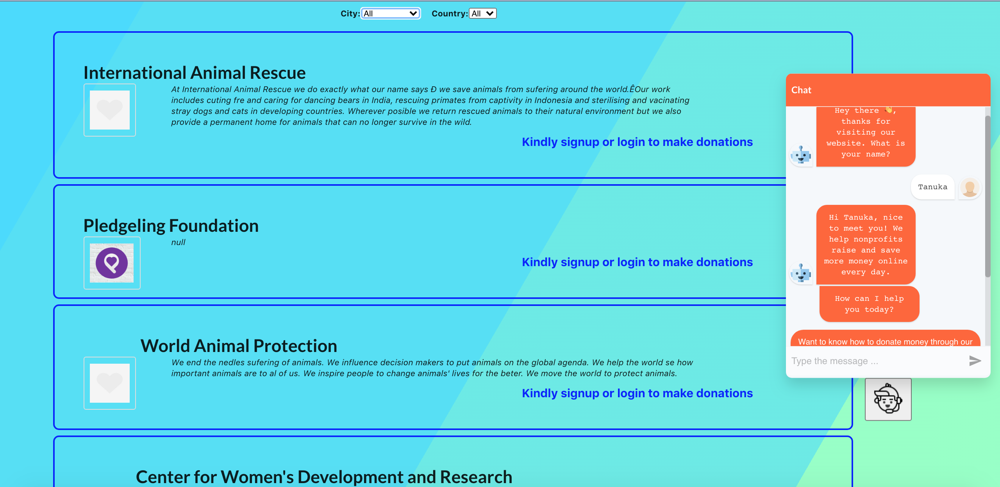
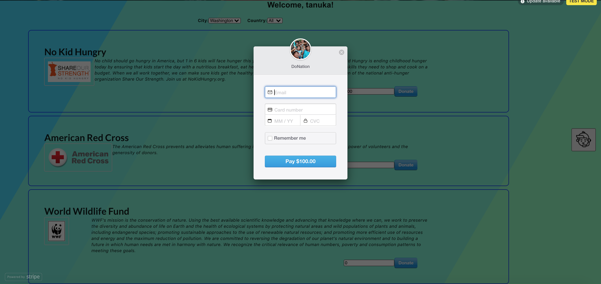

# DoNation (Front-end)

## Tech stack
**Frontend:** React, HTML and CSS 
**Backend:** Ruby on Rails 
**Database:** PostgreSQL 

## Application Figures

Project Page: 
 
 

 

 

## How it works?

- First, learn about the numerous charitable organization provided, filter by city and/or country
- Second, select the organization you would like to support
- Third, sign up or login for the access to the payment option
- Next, use cadit card to award donations
- For more details to navigate through the website checkout the chatbot

## Future functionalities

- add the backend to heroku
- Users dashboard 
- Checkout receipt

**Backend GitHub Repository:** https://github.com/tanuka16/DoNation-Back-end
 
**Live Demo:** https://donation-smile.herokuapp.com/
